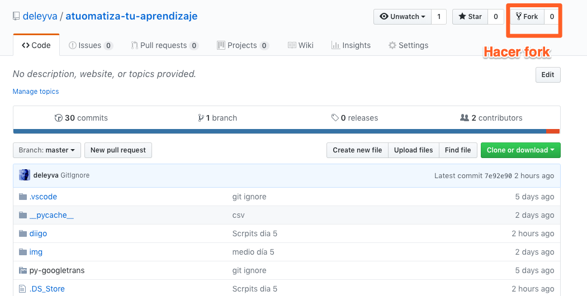
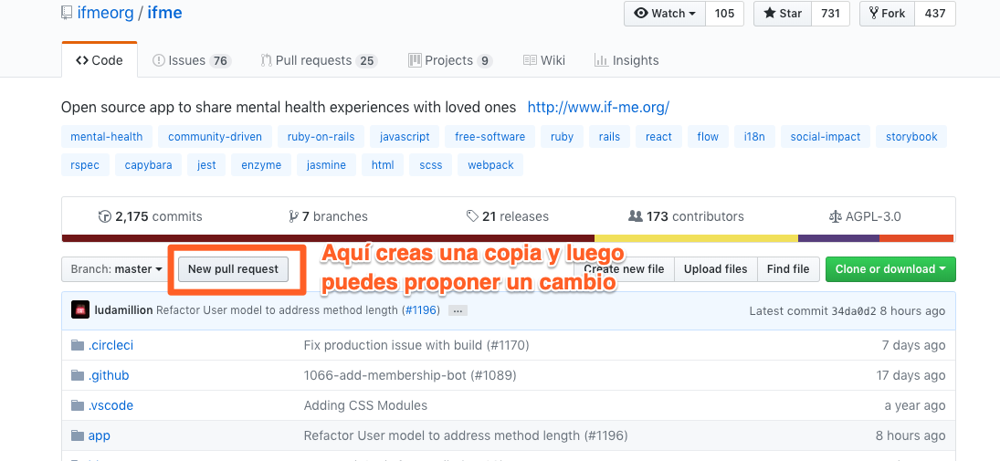

# Contribuye al software libre

Qué suerte tener todas estas librerías para utilizarlas y ahorrarnos trabajo. ¿Qué tal si contribuimos? En muchos casos tendremos que editar código simplemente para que nos funcione a nosotros. En esos casos no nos costaría nada mejorarlo para todos.

¿Y si además consiguiéramos una camiseta?

Regístrate en [github](https://github.com/)

Una vez registrado, regístrate también en la web de [Hacktoberfest](https://hacktoberfest.digitalocean.com/)

¡Ya puedes navegar y proponer un cambio en cualquier repo!

https://www.youtube.com/watch?v=QntLv5BjUr0

[Aquí](https://github.com/deleyva/atuomatiza-tu-aprendizaje) tienes un proyecto que te interesa para comenzar.