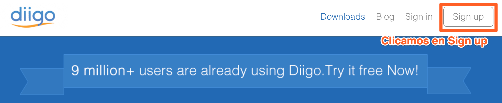
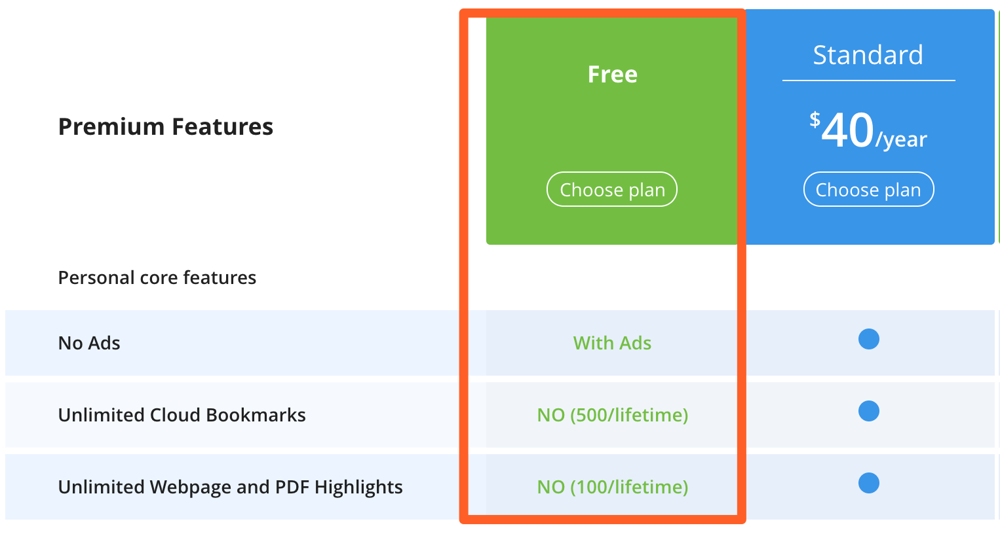
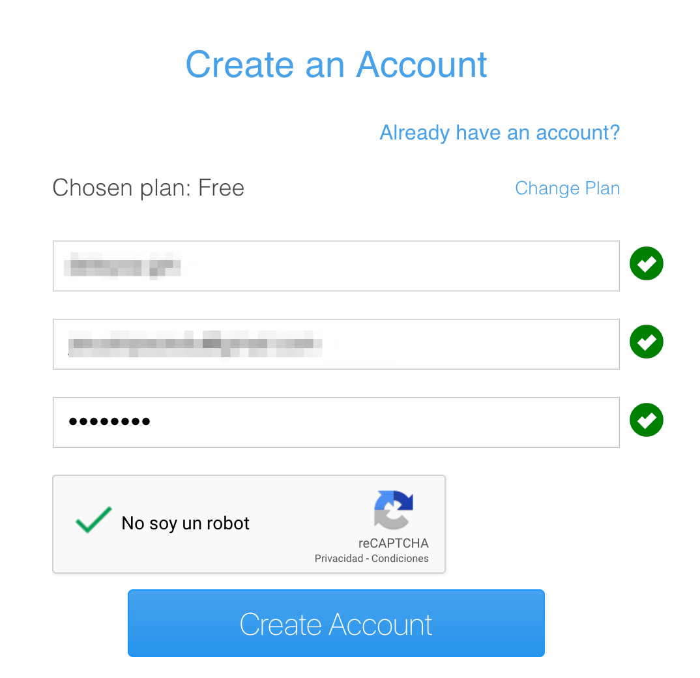
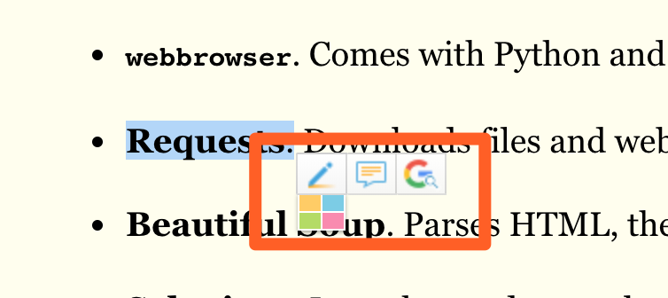
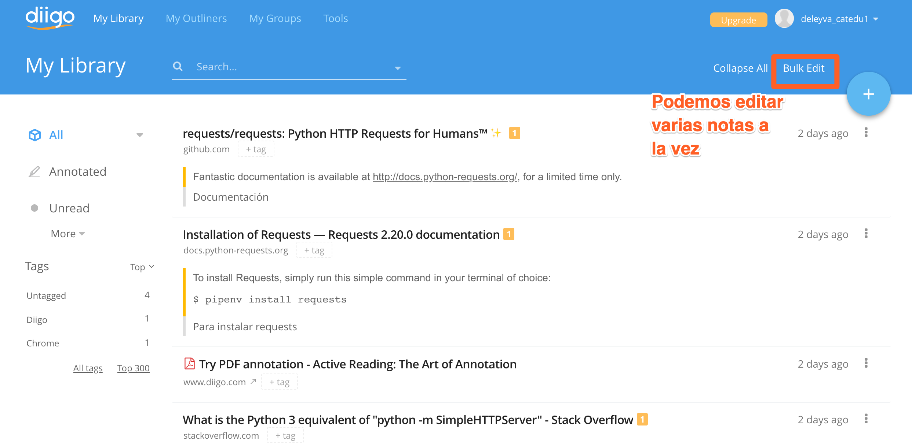
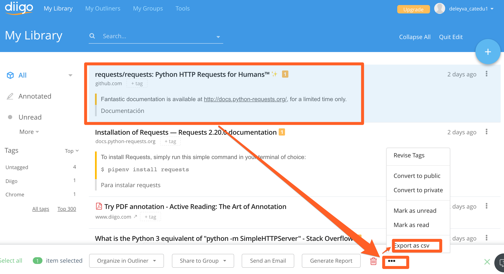

## Manejo de diigo

Digo es una plataforma que nos permite guardar los subrayados que vayamos haciendo en internet. También nos permite subir nuestros propios PDFs, Words e imágenes para subrayarlos y anotarlos. La versión de pago permite incluso importar tus subrayados de los libros comprados en Kindle.

## Nos hacemos una cuenta

En primer lugar, accedemos a [Diigo](https://www.diigo.com/) y nos hacemos una cuenta:



Elegimos el plan gratuito que nos permite hasta 500 subrayados y guardar hasta 100 páginas.



Y ya podemos introducir nuestros datos:



**Una vez hayamos confirmado nuestro mail** podemos instalar la extensión de Diigo:


Cuando hemos instalado la extensión Diigo podremos subrayar cualquier texto de la web añadiendole anotaciones:



Si accedemos a nuestra librería podremos editar de manera masiva nuestras notas:



Entonces podremos seleccionar las notas de una página en concreto y descargarnoslas en csv.



A partir de ahí, podremos trabajar con nuestras notas en csv para importarlas a Anki. Sólo hará falta transformarlas en archivo tsv. ¿Cómo lo hacemos?

%accordion%Solución%accordion%
```python
import csv

with open('D:/AddressEvaluation/NAD/NAD.csv','r') as csvin, open('D:/NAD.txt', 'w') as tsvout:
    csvin = csv.reader(csvin)
    tsvout = csv.writer(tsvout, delimiter='\t')

    for row in csvin:
        tsvout.writerow(row)
```
%/accordion%
