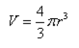

# Memorizando fórmulas matemáticas

De los enfoques que he leído hasta la fecha, el que más me ha convencido es el propuesto por [Ron White](http://ronwhitetraining.com/).

Se trata, como es habitual, de convertir la fórmula en imagen. Para ello proponía el siguiente ejemplo con la fórmula para hallar el volumen de una esfera:

## Traducción en imágenes

* Esfera = La Tierra
* pi = Un trozo de tarta (del inglés 'pie')
* R (radio) = Una rata

A partir de ahí propone la siguiente imagen:

Ves frente a tí La Tierra, que tiene 7 continentes, 4 en el polo norte y 3 en el sur. En el norte, visualizas una tarta. Tratas de llegar a ella para comer un poco pero ves que una rata ya había estado comiendo antes y se te quitan las ganas de probarla. La rata esta en un cubito cuadrado de hielo. Se ha congelado al estar en el polo norte.

<iframe src="https://giphy.com/embed/CiYImHHBivpAs" width="480" height="264" frameBorder="0" class="giphy-embed" allowFullScreen></iframe>
<a href="https://giphy.com/gifs/trump-violence-tone-CiYImHHBivpAs">via GIPHY</a>

