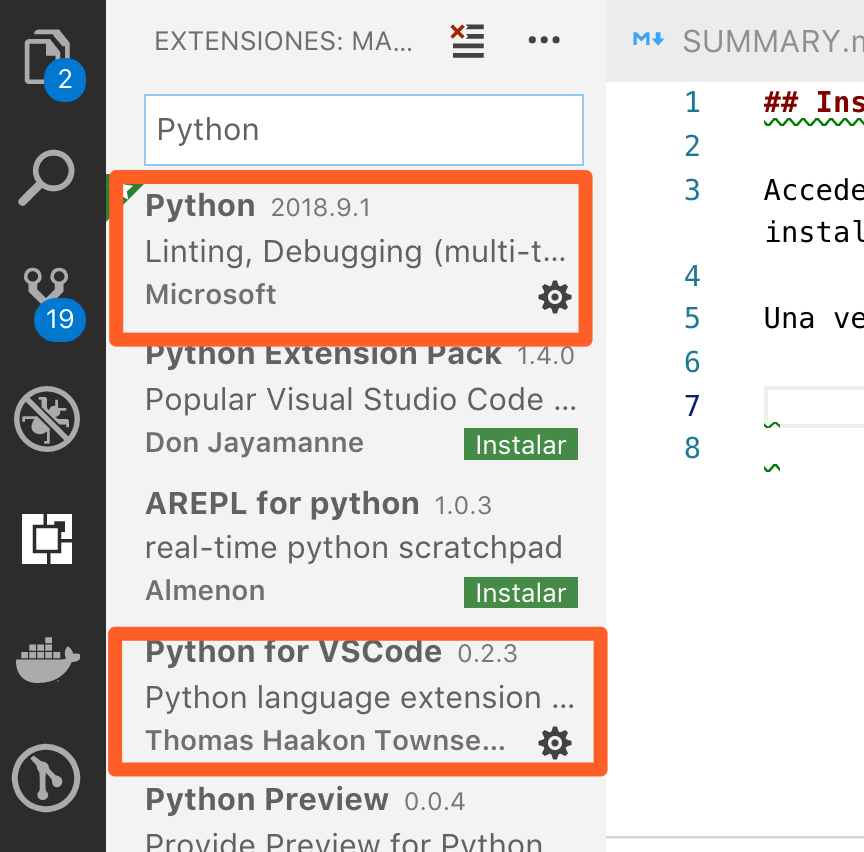

## Instalando Visual Studio

Accedemos a la [web](https://code.visualstudio.com/) del proyecto y descargamos el instalador.

Una vez lo tengamos instalado, añadimos los complementos necesarios para Python:



Dentro del Visual Studio Code, presionando Ctr+ñ en Windows, abrimos la terminal.

Creamos la carpeta sobre la que queremos trabajar:

```bash
mkdir proyecto_prueba
cd proyecto_prueba
```

Una vez allí instalamos pipenv:

```python
pip install pipenv
```

Luego lo activamos:

```python
pipenv shell
```

Comprobamos cuál es nuestro entorno virtual:

```python
pipenv run which python
```

Y ya podemos instalar nuestras librerías:

```python
pipenv install 
```

Para desactivar el entorno virtual:

```python
deactivate
```