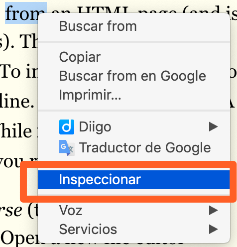
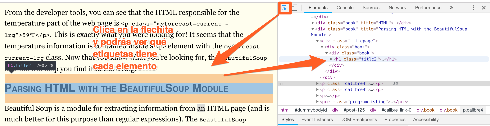

## Web scraping (simple)

Artículo extendido [aqui](https://automatetheboringstuff.com/chapter11/).

En este capítulo utilizaremos 4 librerías que nos harán más fácil hacer webscraping:

* [webbrowser](https://docs.python.org/3.7/library/webbrowser.html)
* [Requests](http://docs.python-requests.org/en/master/)
* [BeautifulSoup](https://www.crummy.com/software/BeautifulSoup/bs4/doc/)
* [Selenium](https://www.seleniumhq.org/)

El módulo webbrowser abre un navegador:

```python
>>> import webbrowser
>>> webbrowser.open('http://inventwithpython.com/')
```

Imaginaros que queremos buscar una dirección en Googlemaps que hemos copiado en nuestro portapapeles.

Segundo tendremos que instalar pyperclip 'pip install pyperclip. Luego podremos correr nuestro programa

¿Cómo recibe nuestra ejecución del script argumentos? Presta atención al siguiente código:

```python
#! python3
# mapIt.py - Launches a map in the browser using an address from the
# command line or clipboard.

import webbrowser, sys, pyperclip # pyperclip gestiona nuestro portapapeles
if len(sys.argv) > 1:
    # Get address from command line.
    address = ' '.join(sys.argv[1:])
else:
    # Get address from clipboard.
    address = pyperclip.paste()

webbrowser.open('https://www.google.com/maps/place/' + address)
```

¡Efectiamente! Importando la librería sys accediendo al atributo sys.argv.

## Bajando una web con requests

```python
>>> import requests
>>> res = requests.get('https://automatetheboringstuff.com/files/rj.txt')
>>> type(res)
   <class 'requests.models.Response'>
>>> res.status_code == requests.codes.ok
   True
>>> len(res.text)
   178981
>>> print(res.text[:250])
   The Project Gutenberg EBook of Romeo and Juliet, by William Shakespeare

   This eBook is for the use of anyone anywhere at no cost and with
   almost no restrictions whatsoever. You may copy it, give it away or
   re-use it under the terms of the Proje
```

## Comprobando errores

```python
>>> res = requests.get('http://inventwithpython.com/page_that_does_not_exist')
>>> res.raise_for_status()
Traceback (most recent call last):
  File "<pyshell#138>", line 1, in <module>
    res.raise_for_status()
  File "C:\Python34\lib\site-packages\requests\models.py", line 773, in raise_for_status
    raise HTTPError(http_error_msg, response=self)
requests.exceptions.HTTPError: 404 Client Error: Not Found
```

El método raise_for_status() es una buena manera de garantizar que un programa se detenga si se produce una descarga incorrecta. Esto es bueno: desea que su programa se detenga tan pronto como ocurra algún error inesperado. Si una descarga fallida no es un factor decisivo para su programa, puede ajustar la línea raise_for_status() con las declaraciones try y except para manejar este caso de error sin fallar.

```python
import requests
res = requests.get('http://inventwithpython.com/page_that_does_not_exist')
try:
    res.raise_for_status()
except Exception as exc:
    print('There was a problem: %s' % (exc))
```

## Guardando archivos descargados al disco duro

Para escribir la página web en un archivo, puede usar un bucle for con el método iter_content() del objeto Response.

```python
>>> import requests
>>> res = requests.get('https://automatetheboringstuff.com/files/rj.txt')
>>> res.raise_for_status()
>>> playFile = open('RomeoAndJuliet.txt', 'wb')
>>> for chunk in res.iter_content(100000):
        playFile.write(chunk)

	100000
	78981
>>> playFile.close()
```

El método iter_content() devuelve "fragmentos" del contenido en cada iteración a través del bucle. Cada fragmento es del tipo de datos de bytes, y puede especificar cuántos bytes contendrá cada fragmento. Cien mil bytes es generalmente un buen tamaño, así que pase 100000 como argumento a iter_content().

## HTML básico

El código fuente de una web puede ser algo así:

```html
<html>

<body>
    <h1>Esto es un título</h1>
    <p>esto es un párrafo</p>
    <li>Elemento 1</li>
    <li>Elemento 2</li>
    <li>Elemento 3</li>
    <li>Elemento 4</li>

</body>

</html>
```

En Google Chrome, si abres el inspector podrás aprender mucho sobre html. Clica sobre cualquier página con el botón derecho del ratón y abre el inspector:



Luego clica en la flecha para realizar una inspección interactiva:



## Parseando el html

```python
>>> import requests, bs4
>>> res = requests.get('http://nostarch.com')
>>> res.raise_for_status()
>>> noStarchSoup = bs4.BeautifulSoup(res.text)
>>> type(noStarchSoup)
<class 'bs4.BeautifulSoup'>
```

### Encontrando un elemento con el método select()

<table summary="Examples of CSS Selectors" class="calibre9">
<colgroup class="calibre10">
<col class="calibre11">
<col class="calibre11">
</colgroup>
<thead class="calibre12">
<tr class="calibre13">
<th valign="top" class="calibre14">
<p class="calibre4">Selector passed to the <code class="literal2">select()</code> method</p>
</th>
<th valign="top" class="calibre15">
<p class="calibre4">Will match...</p>
</th>
</tr>
</thead>
<tbody class="calibre16">
<tr class="calibre13">
<td valign="top" class="calibre17">
<p class="calibre4"><code class="literal2">soup.select('div')</code></p>
</td>
<td valign="top" class="calibre18">
<p class="calibre4">All elements named <code class="literal2">&lt;div&gt;</code></p>
</td>
</tr>
<tr class="calibre19">
<td valign="top" class="calibre17">
<p class="calibre4"><code class="literal2">soup.select('#author')</code></p>
</td>
<td valign="top" class="calibre18">
<p class="calibre4">The element with an <code class="literal2">id</code> attribute of <code class="literal2">author</code></p>
</td>
</tr>
<tr class="calibre13">
<td valign="top" class="calibre17">
<p class="calibre4"><code class="literal2">soup.select('.notice')</code></p>
</td>
<td valign="top" class="calibre18">
<p class="calibre4">All elements that use a CSS <code class="literal2">class</code> attribute named <code class="literal2">notice</code></p>
</td>
</tr>
<tr class="calibre19">
<td valign="top" class="calibre17">
<p class="calibre4"><code class="literal2">soup.select('div span')</code></p>
</td>
<td valign="top" class="calibre18">
<p class="calibre4">All elements named <code class="literal2">&lt;span&gt;</code> that are within an element named <code class="literal2">&lt;div&gt;</code></p>
</td>
</tr>
<tr class="calibre13">
<td valign="top" class="calibre17">
<p class="calibre4"><code class="literal2">soup.select('div &gt; span')</code></p>
</td>
<td valign="top" class="calibre18">
<p class="calibre4">All elements named <code class="literal2">&lt;span&gt;</code> that are <span class="calibre1"><em class="calibre5">directly</em></span> within an element named <code class="literal2">&lt;div&gt;</code>, with no other element in between</p>
</td>
</tr>
<tr class="calibre19">
<td valign="top" class="calibre17">
<p class="calibre4"><code class="literal2">soup.select('input[name]')</code></p>
</td>
<td valign="top" class="calibre18">
<p class="calibre4">All elements named <code class="literal2">&lt;input&gt;</code> that have a <code class="literal2">name</code> attribute with any value</p>
</td>
</tr>
<tr class="calibre13">
<td valign="top" class="calibre20">
<p class="calibre4"><code class="literal2">soup.select('input[type="button"]')</code></p>
</td>
<td valign="top" class="calibre21">
<p class="calibre4">All elements named <code class="literal2">&lt;input&gt;</code> that have an attribute named <code class="literal2">type</code> with value <code class="literal2">button</code></p>
</td>
</tr>
</tbody>
</table>

### Recetas BeautifulSoup

```python
>>> import bs4
>>> exampleFile = open('example.html')
>>> exampleSoup = bs4.BeautifulSoup(exampleFile.read())
>>> elems = exampleSoup.select('#author')
>>> type(elems)
<class 'list'>
>>> len(elems)
1
>>> type(elems[0])
<class 'bs4.element.Tag'>
>>> elems[0].getText()
'Al Sweigart'
>>> str(elems[0])
'<span id="author">Al Sweigart</span>'
>>> elems[0].attrs
{'id': 'author'}
```

```python
>>> pElems = exampleSoup.select('p')
>>> str(pElems[0])
'<p>Download my <strong>Python</strong> book from <a href="http://
inventwithpython.com">my website</a>.</p>'
>>> pElems[0].getText()
'Download my Python book from my website.'
>>> str(pElems[1])
'<p class="slogan">Learn Python the easy way!</p>'
>>> pElems[1].getText()
'Learn Python the easy way!'
>>> str(pElems[2])
'<p>By <span id="author">Al Sweigart</span></p>'
>>> pElems[2].getText()
'By Al Sweigart'
```

### Extrayendo datos de los atributos de un elemento

```python
>>> import bs4
>>> soup = bs4.BeautifulSoup(open('example.html'))
>>> spanElem = soup.select('span')[0]
>>> str(spanElem)
'<span id="author">Al Sweigart</span>'
>>> spanElem.get('id')
'author'
>>> spanElem.get('some_nonexistent_addr') == None
True
>>> spanElem.attrs
{'id': 'author'}
```

### Programa de ejemplo

¿Qué hace el siguiente programa?

```python
#! python3
# downloadXkcd.py - Downloads every single XKCD comic.

import requests, os, bs4

url = 'http://xkcd.com'              # starting url
os.makedirs('xkcd', exist_ok=True)   # store comics in ./xkcd
while not url.endswith('#'):
    # Download the page.
    print('Downloading page %s...' % url)
    res = requests.get(url)
    res.raise_for_status()

    soup = bs4.BeautifulSoup(res.text)
    comicElem = soup.select('#comic img')
    if comicElem == []:
         print('Could not find comic image.')
    else:
         try:
             comicUrl = 'http:' + comicElem[0].get('src')
             # Download the image.
             print('Downloading image %s...' % (comicUrl))
             res = requests.get(comicUrl)
             res.raise_for_status()
         except requests.exceptions.MissingSchema:
             # skip this comic
             prevLink = soup.select('a[rel="prev"]')[0]
             url = 'http://xkcd.com' + prevLink.get('href')
             continue

        # Save the image to ./xkcd.
        imageFile = open(os.path.join('xkcd', os.path.basename(comicUrl)), 'wb')
        for chunk in res.iter_content(100000):
            imageFile.write(chunk)
        imageFile.close()

    # Get the Prev button's url.
    prevLink = soup.select('a[rel="prev"]')[0]
    url = 'http://xkcd.com' + prevLink.get('href')

print('done')
```

## Controlando el navegador con Selenium

Para estos ejemplos, necesitarás el navegador web Firefox. Este será el navegador que controlas. Si aún no tiene Firefox, puede descargarlo gratuitamente desde http://getfirefox.com/. 

Importar los módulos para Selenium es un poco complicado. En lugar de importar selenium, debe ejecutarse desde 'seleium import webdriver'. (La razón exacta por la que el módulo de selenio se configura de esta manera está fuera del alcance de este libro). Después de eso, puede iniciar el navegador Firefox con Selenium. Ingrese lo siguiente en el shell interactivo:

```python
>>> from selenium import webdriver
>>> browser = webdriver.Firefox()
>>> type(browser)
<class 'selenium.webdriver.firefox.webdriver.WebDriver'>
>>> browser.get('http://inventwithpython.com')
```

### Encontrando elementos en la página

<table summary="Selenium’s WebDriver Methods for Finding Elements" class="calibre9">
<colgroup class="calibre10">
<col class="calibre11">
<col class="calibre11">
</colgroup>
<thead class="calibre12">
<tr class="calibre13">
<th valign="top" class="calibre14">
<p class="calibre4"><a id="calibre_link-305" class="calibre1"></a><a id="calibre_link-323" class="calibre1"></a><a id="calibre_link-385" class="calibre1"></a><a id="calibre_link-735" class="calibre1"></a><a id="calibre_link-902" class="calibre1"></a><a id="calibre_link-903" class="calibre1"></a><a id="calibre_link-906" class="calibre1"></a><a id="calibre_link-1016" class="calibre1"></a><a id="calibre_link-1551" class="calibre1"></a><a id="calibre_link-1693" class="calibre1"></a>Method name</p>
</th>
<th valign="top" class="calibre15">
<p class="calibre4">WebElement object/list returned</p>
</th>
</tr>
</thead>
<tbody class="calibre16">
<tr class="calibre13">
<td valign="top" class="calibre17"><a id="calibre_link-2988" class="calibre1"></a>
<pre class="programlisting2">browser.find_element_by_class_name(<span class="calibre1"><em class="literal3">name</em></span>)
browser.find_elements_by_class_name(<span class="calibre1"><em class="literal3">name</em></span>)</pre>
</td>
<td valign="top" class="calibre18">
<p class="calibre4">Elements that use the CSS class <span class="calibre1"><em class="calibre5"><code class="literal4">name</code></em></span></p>
</td>
</tr>
<tr class="calibre19">
<td valign="top" class="calibre17"><a id="calibre_link-2989" class="calibre1"></a>
<pre class="programlisting2">browser.find_element_by_css_selector(<span class="calibre1"><em class="literal3">selector</em></span>)
browser.find_elements_by_css_selector(<span class="calibre1"><em class="literal3">selector</em></span>)</pre>
</td>
<td valign="top" class="calibre18">
<p class="calibre4">Elements that match the CSS <span class="calibre1"><em class="calibre5"><code class="literal4">selector</code></em></span></p>
</td>
</tr>
<tr class="calibre13">
<td valign="top" class="calibre17"><a id="calibre_link-2990" class="calibre1"></a>
<pre class="programlisting2">browser.find_element_by_id(<span class="calibre1"><em class="literal3">id</em></span>)
browser.find_elements_by_id(<span class="calibre1"><em class="literal3">id</em></span>)</pre>
</td>
<td valign="top" class="calibre18">
<p class="calibre4">Elements with a matching <span class="calibre1"><em class="calibre5"><code class="literal4">id</code></em></span> attribute value</p>
</td>
</tr>
<tr class="calibre19">
<td valign="top" class="calibre17"><a id="calibre_link-2991" class="calibre1"></a>
<pre class="programlisting2">browser.find_element_by_link_text(<span class="calibre1"><em class="literal3">text</em></span>)
browser.find_elements_by_link_text(<span class="calibre1"><em class="literal3">text</em></span>)</pre>
</td>
<td valign="top" class="calibre18">
<p class="calibre4"><code class="literal2">&lt;a&gt;</code> elements that completely match the <span class="calibre1"><em class="calibre5"><code class="literal4">text</code></em></span> provided</p>
</td>
</tr>
<tr class="calibre13">
<td valign="top" class="calibre17"><a id="calibre_link-2992" class="calibre1"></a>
<pre class="programlisting2">browser.find_element_by_partial_link_text(<span class="calibre1"><em class="literal3">text</em></span>)
browser.find_elements_by_partial_link_text(<span class="calibre1"><em class="literal3">text</em></span>)</pre>
</td>
<td valign="top" class="calibre18">
<p class="calibre4"><code class="literal2">&lt;a&gt;</code> elements that contain the <span class="calibre1"><em class="calibre5"><code class="literal4">text</code></em></span> provided</p>
</td>
</tr>
<tr class="calibre19">
<td valign="top" class="calibre17"><a id="calibre_link-2993" class="calibre1"></a>
<pre class="programlisting2">browser.find_element_by_name(<span class="calibre1"><em class="literal3">name</em></span>)
browser.find_elements_by_name(<span class="calibre1"><em class="literal3">name</em></span>)</pre>
</td>
<td valign="top" class="calibre18">
<p class="calibre4">Elements with a matching <span class="calibre1"><em class="calibre5"><code class="literal4">name</code></em></span> attribute value</p>
</td>
</tr>
<tr class="calibre13">
<td valign="top" class="calibre20"><a id="calibre_link-2994" class="calibre1"></a>
<pre class="programlisting2">browser.find_element_by_tag_name(<span class="calibre1"><em class="literal3">name</em></span>)
browser.find_elements_by_tag_name(<span class="calibre1"><em class="literal3">name</em></span>)</pre>
</td>
<td valign="top" class="calibre21">
<p class="calibre4">Elements with a matching tag <span class="calibre1"><em class="calibre5"><code class="literal4">name</code></em></span> (case insensitive; an <code class="literal2">&lt;a&gt;</code> element is matched by <code class="literal2">'a'</code> and <code class="literal2">'A'</code>)</p>
</td>
</tr>
</tbody>
</table>

Excepto por los métodos * _by_tag_name (), los argumentos de todos los métodos distinguen entre mayúsculas y minúsculas.

<table summary="WebElement Attributes and Methods" class="calibre9">
<colgroup class="calibre10">
<col class="calibre11">
<col class="calibre11">
</colgroup>
<thead class="calibre12">
<tr class="calibre13">
<th valign="top" class="calibre14">
<p class="calibre4">Attribute or method</p>
</th>
<th valign="top" class="calibre15">
<p class="calibre4">Description</p>
</th>
</tr>
</thead>
<tbody class="calibre16">
<tr class="calibre13">
<td valign="top" class="calibre17">
<p class="calibre4"><code class="literal2">tag_name</code></p>
</td>
<td valign="top" class="calibre18">
<p class="calibre4">The tag name, such as <code class="literal2">'a'</code> for an <code class="literal2">&lt;a&gt;</code> element</p>
</td>
</tr>
<tr class="calibre19">
<td valign="top" class="calibre17">
<p class="calibre4"><code class="literal2">get_attribute(</code><span class="calibre1"><em class="calibre5"><code class="literal4">name</code></em></span><code class="literal2">)</code></p>
</td>
<td valign="top" class="calibre18">
<p class="calibre4">The value for the element’s <code class="literal2">name</code> attribute</p>
</td>
</tr>
<tr class="calibre13">
<td valign="top" class="calibre17">
<p class="calibre4"><code class="literal2">text</code></p>
</td>
<td valign="top" class="calibre18">
<p class="calibre4">The text within the element, such as <code class="literal2">'hello'</code> in <code class="literal2">&lt;span&gt;hello&lt;/span&gt;</code></p>
</td>
</tr>
<tr class="calibre19">
<td valign="top" class="calibre17">
<p class="calibre4"><code class="literal2">clear()</code></p>
</td>
<td valign="top" class="calibre18">
<p class="calibre4">For text field or text area elements, clears the text typed into it</p>
</td>
</tr>
<tr class="calibre13">
<td valign="top" class="calibre17">
<p class="calibre4"><code class="literal2">is_displayed()</code></p>
</td>
<td valign="top" class="calibre18">
<p class="calibre4">Returns <code class="literal2">True</code> if the element is visible; otherwise returns <code class="literal2">False</code></p>
</td>
</tr>
<tr class="calibre19">
<td valign="top" class="calibre17">
<p class="calibre4"><code class="literal2">is_enabled()</code></p>
</td>
<td valign="top" class="calibre18">
<p class="calibre4">For input elements, returns <code class="literal2">True</code> if the element is enabled; otherwise returns <code class="literal2">False</code></p>
</td>
</tr>
<tr class="calibre13">
<td valign="top" class="calibre17">
<p class="calibre4"><code class="literal2">is_selected()</code></p>
</td>
<td valign="top" class="calibre18">
<p class="calibre4">For checkbox or radio button elements, returns <code class="literal2">True</code> if the element is selected; otherwise returns <code class="literal2">False</code></p>
</td>
</tr>
<tr class="calibre19">
<td valign="top" class="calibre20">
<p class="calibre4"><code class="literal2">location</code></p>
</td>
<td valign="top" class="calibre21">
<p class="calibre4">A dictionary with keys <code class="literal2">'x'</code> and <code class="literal2">'y'</code> for the position of the element in the page</p>
</td>
</tr>
</tbody>
</table>

Por ejemplo, abre tu editor de código y corre el siguiente programa:

```python
from selenium import webdriver
browser = webdriver.Firefox()
browser.get('http://inventwithpython.com')
try:
    elem = browser.find_element_by_class_name('bookcover')
    print('Found <%s> element with that class name!' % (elem.tag_name))
except:
    print('Was not able to find an element with that name.')
```

### Clicando en la página

```python
from selenium import webdriver
browser = webdriver.Firefox()
browser = webdriver.Firefox()
linkElem = browser.find_element_by_link_text('YouTube')
type(linkElem)
<class 'selenium.webdriver.remote.webelement.WebElement'>
linkElem.click() # follows the "Read It Online" link
```

### Rellenando y enviando formularios

```python
from selenium import webdriver
import time
browser = webdriver.Firefox()
browser.get('https://mail.yahoo.com')
emailElem = browser.find_element_by_id('login-username')
emailElem.send_keys('not_my_real_email')
linkElem = browser.find_element_by_id('login-signin')
linkElem.click()
time.sleep(5)
passwordElem = browser.find_element_by_id('login-passwd')
passwordElem.send_keys('12345')
linkElem = browser.find_element_by_id('login-signin')
linkElem.click()
```

### Enviando claves especiales

Selenium tiene un módulo para las teclas del teclado que es imposible escribir en un valor de cadena, que funciona de manera muy similar a los caracteres de escape. Estos valores se almacenan en atributos en el módulo selenium.webdriver.common.keys. Dado que es un nombre de módulo tan largo, es mucho más fácil ejecutarlo desde selenium.webdriver.common.keys import Keys en la parte superior de su programa; si lo hace, simplemente puede escribir claves en cualquier lugar donde normalmente tendría que escribir selenium.webdriver.common.keys. La siguiente tabla enumera las variables de claves comúnmente utilizadas.

<table summary="Commonly Used Variables in the selenium.webdriver.common.keys Module" class="calibre9">
<colgroup class="calibre10">
<col class="calibre11">
<col class="calibre11">
</colgroup>
<thead class="calibre12">
<tr class="calibre13">
<th valign="top" class="calibre14">
<p class="calibre4">Attributes</p>
</th>
<th valign="top" class="calibre15">
<p class="calibre4">Meanings</p>
</th>
</tr>
</thead>
<tbody class="calibre16">
<tr class="calibre13">
<td valign="top" class="calibre17">
<p class="calibre4"><code class="literal2">Keys.DOWN</code>, <code class="literal2">Keys.UP</code>, <code class="literal2">Keys.LEFT</code>, <code class="literal2">Keys.RIGHT</code></p>
</td>
<td valign="top" class="calibre18">
<p class="calibre4">The keyboard arrow keys</p>
</td>
</tr>
<tr class="calibre19">
<td valign="top" class="calibre17">
<p class="calibre4"><code class="literal2">Keys.ENTER</code>, <code class="literal2">Keys.RETURN</code></p>
</td>
<td valign="top" class="calibre18">
<p class="calibre4">The <span class="smaller">ENTER</span> and <span class="smaller">RETURN</span> keys</p>
</td>
</tr>
<tr class="calibre13">
<td valign="top" class="calibre17">
<p class="calibre4"><code class="literal2">Keys.HOME</code>, <code class="literal2">Keys.END</code>, <code class="literal2">Keys.PAGE_DOWN</code>, <code class="literal2">Keys.PAGE_UP</code></p>
</td>
<td valign="top" class="calibre18">
<p class="calibre4">The <code class="literal2">home</code>, <code class="literal2">end</code>, <code class="literal2">pagedown</code>, and <code class="literal2">pageup</code> keys</p>
</td>
</tr>
<tr class="calibre19">
<td valign="top" class="calibre17">
<p class="calibre4"><code class="literal2">Keys.ESCAPE</code>, <code class="literal2">Keys.BACK_SPACE</code>, <code class="literal2">Keys.DELETE</code></p>
</td>
<td valign="top" class="calibre18">
<p class="calibre4">The <span class="smaller">ESC</span>, <span class="smaller">BACKSPACE</span>, and <span class="smaller">DELETE</span> keys</p>
</td>
</tr>
<tr class="calibre13">
<td valign="top" class="calibre17">
<p class="calibre4"><code class="literal2">Keys.F1</code>, <code class="literal2">Keys.F2</code>,..., <code class="literal2">Keys.F12</code></p>
</td>
<td valign="top" class="calibre18">
<p class="calibre4">The F1 to F12 keys at the top of the keyboard</p>
</td>
</tr>
<tr class="calibre19">
<td valign="top" class="calibre20">
<p class="calibre4"><code class="literal2">Keys.TAB</code></p>
</td>
<td valign="top" class="calibre21">
<p class="calibre4">The <span class="smaller">TAB</span> key</p>
</td>
</tr>
</tbody>
</table>

```python
from selenium import webdriver
from selenium.webdriver.common.keys import Keys
import time
browser = webdriver.Firefox()
browser.get('http://nostarch.com')
time.sleep(2)
htmlElem = browser.find_element_by_tag_name('html')
htmlElem.send_keys(Keys.END)     # scrolls to bottom
time.sleep(3)
htmlElem.send_keys(Keys.HOME)    # scrolls to top
```

### Clicando las teclas del navegador

* browser.back(). Clicks the Back button.
* browser.forward(). Clicks the Forward button.
* browser.refresh(). Clicks the Refresh/Reload button.
* browser.quit(). Clicks the Close Window button.

>**tip**
>
>Selenium puede hacer mucho más que las funciones descritas aquí. Puede modificar las cookies de su navegador, tomar capturas de pantalla de páginas web y ejecutar JavaScript personalizado. Para obtener más información sobre estas funciones, puede visitar la documentación de Selenium en http://selenium-python.readthedocs.org/.

Ejercicios resueltos [15](https://www.py4e.com/tsugi/gclass/launch/18469064325:5eaec5:1308:10b80f) y [16](https://www.py4e.com/tsugi/gclass/launch/18469064325:5eaec5:1310:ea1310).

%accordion%Solución%accordion%

## Ejercicio 15

```python
import requests

req = requests.get('http://data.pr4e.org/intro-short.txt')
headers = req.headers
print(headers['Last-Modified'])
```

## Ejercicio 16

```python
import requests
from bs4 import BeautifulSoup

# Sólo para aprobar
#html = urllib.request.urlopen(url, context=ctx).read()

req = requests.get('http://py4e-data.dr-chuck.net/known_by_Faith.html')

for i in range(7):
	soup = BeautifulSoup(req.text, 'html.parser')
	enlace = soup.find_all('a')
	print(enlace[17].text)
	req = requests.get(enlace[17]['href'])
```


%/accordion%
